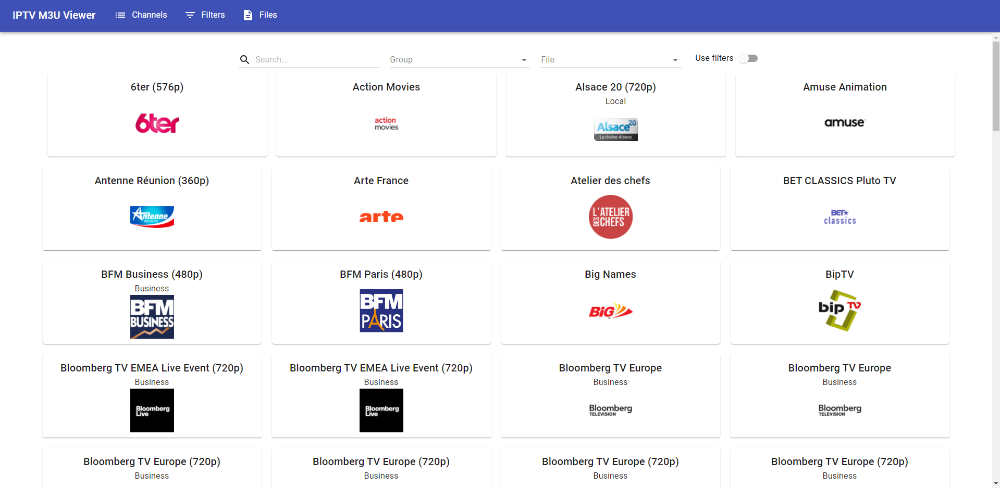

# IPTV M3U Viewer
[Demo](https://noerls.github.io/iptv-m3u-viewer)

Website that parse your IPTV file (M3U) to provide a nice interface to search a channel. Your files are stored locally in the browser storage.

Click on the channel of your choice and paste the url on your streaming app.



A demo is available [here](https://noerls.github.io/iptv-m3u-viewer). You can find a list of publicly available IPTV channels [here](https://github.com/iptv-org/iptv).

# Installation

The recommended way to install it is with docker
## Using Docker

**Docker command**
```sh
docker run -p 3000 noerls/iptv-m3u-viewer
```

**docker-compose.yml**
```yml
version: '3'

services:
  iptv-m3u-viewer:
    container_name: iptv-m3u-viewer
    image: noerls/iptv-m3u-viewer
    ports:
      - "3000:3000"
```

## Using Node
- clone this repository
- install dependencies: `npm install`
- build: `npm run-script build`

Once the build completed, the static website is available inside the `build` directory.

You can serve it by running `npx serve -s build/ -l 3000` or using any other tool to host a static website.

# Legal
This repository do not contain any IPTV links or copyright content.
